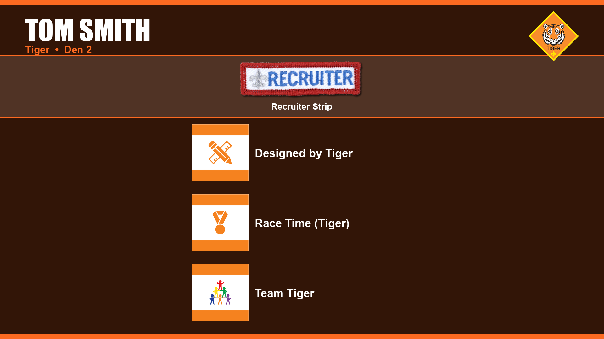

# Cub Scout Award Certificate Generator

Generate broadcast-quality 1920x1080 PNG award certificates for Cub Scout Blue and Gold ceremonies, pack meetings, or other recognition events.

Each scout gets a single slide showing their name, den, rank logo, and all earned awards with badge images downloaded automatically from the BSA CDN.



## Quick Start

This project uses [mise](https://mise.jdx.dev/) to manage Python, the virtualenv, and tasks.

```bash
mise install        # install Python 3.11
mise run install    # create venv and install dependencies
mise run run -- sample.csv -o output/ -p awards.pptx
```

### Tasks

| Task | Command | Description |
|------|---------|-------------|
| install | `mise run install` | Install package in editable mode with all deps |
| run | `mise run run -- <csv> [options]` | Generate award certificates |
| test | `mise run test` | Run full test suite (40 tests) |
| test:fast | `mise run test:fast` | Run tests excluding slow golden-file comparisons |

### Manual Setup (without mise)

```bash
python3 -m venv .venv && source .venv/bin/activate
pip install -e '.[test]'
python3 generate_awards.py sample.csv
```

## Usage

```bash
mise run run -- <purchase_order.csv>
mise run run -- <purchase_order.csv> -o <output_dir>
mise run run -- <purchase_order.csv> -p awards.pptx
```

Options:
- `-o` / `--output-dir` — directory to save PNGs (default: `output/`)
- `-p` / `--pptx` — also generate a PowerPoint file with all slides ordered by rank (Lion, Tiger, Wolf, Bear, Webelos, AOL) then last name

Output PNGs are saved to `output/` by default, with filenames like `wolves_Johnson_Sarah.png`.

## Input CSV

The input CSV is a **Scoutbook purchase order export** — it is not a custom format. To get one:

1. Log in to [Scoutbook](https://scoutbook.scouting.org/)
2. Navigate to your pack's purchase order
3. Export the order as CSV

The CSV has these columns:

| Column | Example | Description |
|--------|---------|-------------|
| First Name | Sarah | Scout's first name |
| Last Name | Johnson | Scout's last name |
| Den Type | wolves | Rank identifier (see below) |
| Den Number | 3 | Den number |
| Quantity | 1 | (unused) |
| SKU | 619941 | Award SKU for image lookup |
| Item Type | Adventure | Award category |
| Price | 2.19 | (unused) |
| Item Name | Cubs Who Care Adventure | Display name |
| Date Earned | 2025-12-01 | (unused) |

### Den Types

`lions`, `tigers`, `wolves`, `bears`, `webelos`, `aol`

### Item Types

- **Adventure** — adventure loop/pin awards (shown in the main grid)
- **Badges of Rank** — rank emblems like Arrow of Light (shown in featured section)
- **Misc Awards** — recruiter strip, etc. (shown in featured section)

## How It Works

1. Parses the CSV and groups awards by scout
2. Downloads badge images from the BSA CDN (cached in `images/`)
3. Generates a 1920x1080 PNG per scout with:
   - Scout name and den info in the header
   - Rank logo in the upper right
   - Featured section for rank badges and special awards
   - Adventure grid (1 or 2 columns based on count)

## Rank Logos

Place rank logo PNGs in `images/` with these names:

- `rank_lion.png`
- `rank_tiger.png`
- `rank_wolf.png`
- `rank_bear.png`
- `rank_webelos.png` (also used for Arrow of Light)

## Award Images

`award_images.json` maps SKUs to badge image URLs. Badge images are automatically downloaded and cached in `images/sku_<SKU>.png` on first run. If a SKU is missing from the JSON, a circular placeholder is generated.

## Testing

```bash
mise run test          # full suite (40 tests, ~2s)
mise run test:fast     # skip golden-file pixel regression
```

Tests live in `tests/` alongside sample data (`sample.csv`) and golden reference images (`tests/golden/`). The golden-file tests generate certificates from sample data and compare pixel-for-pixel against the reference PNGs.
